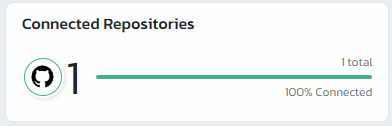
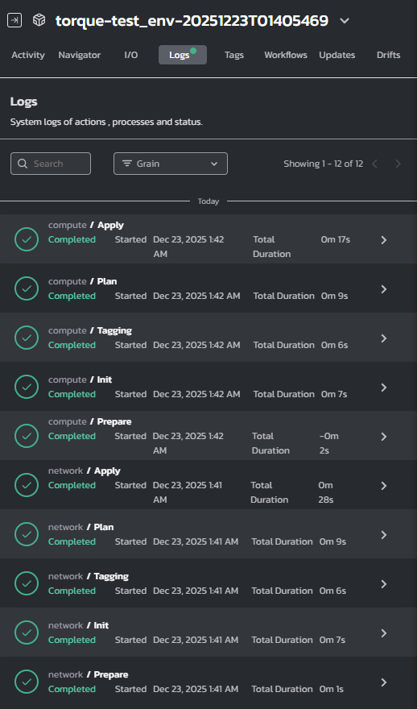
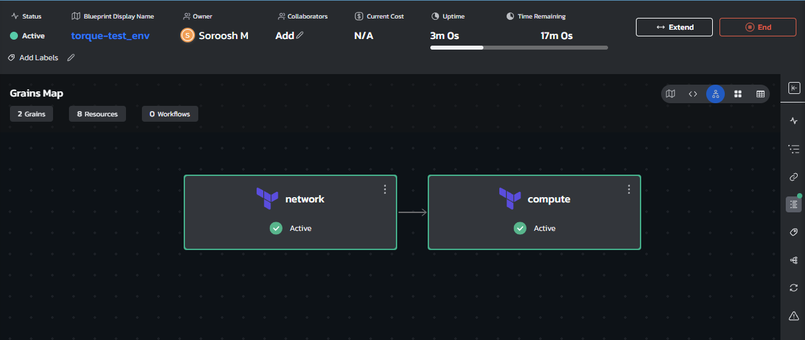
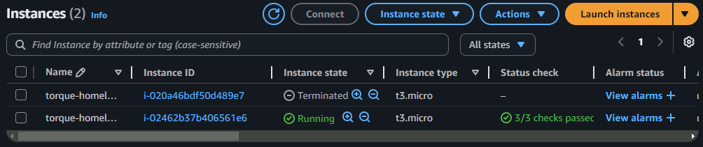
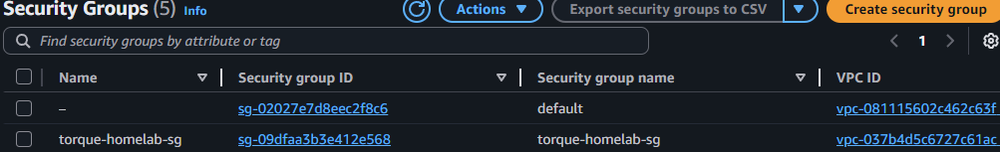
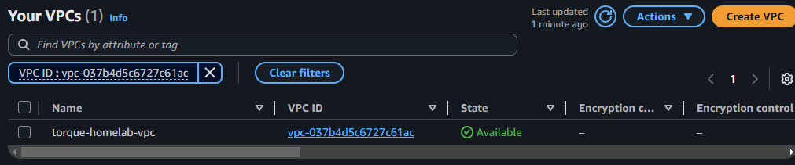
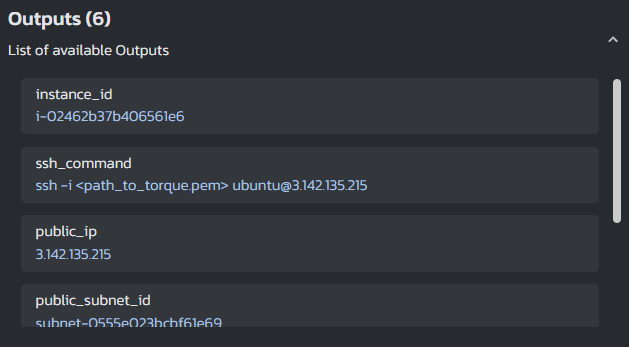

# Torque Homelab

## Overview
A basic Torque blueprint that provisions AWS networking and compute infrastructure. It's split into network and compute grains for modularity, the network grain handles VPC, subnets, and security groups, while the compute grain deploys EC2 instances. The blueprint wires them together so everything connects automatically.

**What's in here:**
- **network grain**: VPC, public subnet, internet gateway, routing, and a security group (SSH + HTTP)
- **compute grain**: EC2 instance that gets deployed into the network grain's outputs

The blueprint wires outputs from the network grain (subnet_id, security_group_id) into the compute grain's inputs, so everything connects automatically.

## Architecture
```
Internet -> IGW -> VPC -> Public Subnet -> EC2 Instance
                                    |
                              Security Group
                          (SSH: restricted, HTTP: open)
```

## Features
- Two Terraform grains with dependencies
- Outputs automatically wired between grains
- GitHub Actions CI that validates Terraform and lints YAML

## Quick Start
1. Get your Torque agent installed and healthy
2. Connect this repo in Torque (you'll need to set up a repo store)
3. Create a blueprint from `blueprints/env.yaml` - **important**: update `store: torque-homelab` to match your actual store name
4. Set up AWS authentication
5. Launch it and wait for the magic to happen
6. Check AWS console to see the resources, then use the outputs (SSH command, public IP, etc.)

## Inputs
- `agent` - Your Torque agent name
- `region` - AWS region (defaults to us-east-2)
- `instance_type` - EC2 size (defaults to t3.micro)
- `key_name` - EC2 key pair if you want SSH access

**Note:** Network grain inputs (VPC CIDR, subnet CIDR, SSH CIDR) are currently hardcoded in the blueprint but can be exposed as blueprint-level inputs if needed.

## Outputs
- `instance_id` - EC2 instance ID
- `public_ip` - Public IPv4 address of the instance
- `ssh_command` - Pre-formatted SSH command (if key_name provided)
- `public_subnet_id` - Public subnet ID from network grain
- `security_group_id` - Security group ID from network grain
- `vpc_id` - VPC ID from network grain

## Screenshots

### Repository Connection

*Repository successfully connected and synced in Torque*

### Environment Launch

*Launch logs showing successful deployment of network and compute grains*

### Environment Status

*Environment in "Running" state with all grains successfully provisioned*

### AWS Resources



*Provisioned AWS resources: VPC, public subnet, internet gateway, and EC2 instance*

### Environment Outputs

*Environment outputs displayed in Torque UI, including instance ID, public IP, and SSH command*

## Challenges Faced

### Agent Setup Issues
Initially, the agent installation appeared successful, but blueprint launches were failing silently. After troubleshooting, removing and re-adding the agent resolved the connectivity issues. This highlighted the importance of verifying agent health beyond just the "connected" status in the UI.

## Optimizations

### CI
Added GitHub Actions workflow (`.github/workflows/ci.yml`) that:
- Validates Terraform syntax and formatting for both grains
- Lints blueprint YAML files
- Runs on every PR and push to main branch
- Catches errors before they reach Torque

### Variable Defaults and Optional Parameters
Set sensible defaults (e.g., region, instance_type) and made key_name optional with conditional logic, allowing the blueprint to work with or without SSH key configuration.

### Resource Tagging
All AWS resources are consistently tagged with `ManagedBy: Terraform` and `Tool: Torque` for easy identification and cost tracking.

